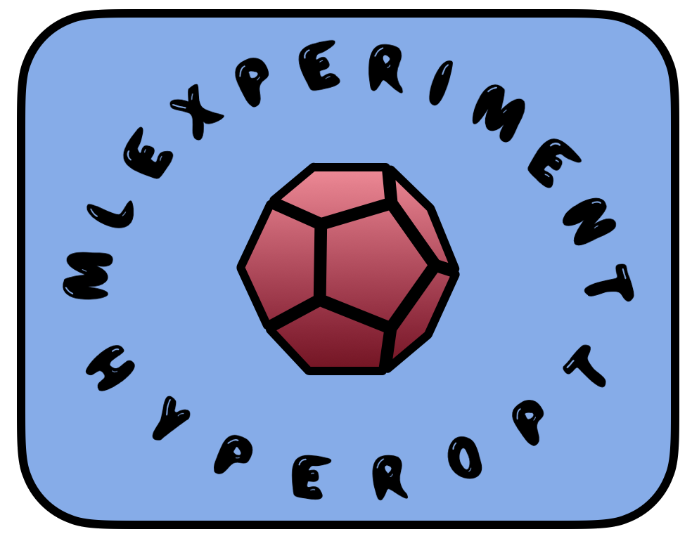

# `mle-hyperopt`: Lightweight Hyperparameter Optimization 🚀
[](https://pypi.python.org/pypi/mle-logging)
[](https://badge.fury.io/py/mle-logging)
[](https://github.com/psf/black)
[](https://colab.research.google.com/github/RobertTLange/mle-logging/blob/main/examples/getting_started.ipynb)
<a href="docs/logo_transparent.png_2"></a>

Simple and intuitive hyperparameter optimization API for your Machine Learning Experiments (MLE). For a quickstart checkout the [notebook blog](https://github.com/RobertTLange/mle-hyperopt/blob/main/examples/getting_started.ipynb).

## The API 🎮

```python
from mle_hyperopt import RandomSearch

# Instantiate random search class
strategy = RandomSearch(hyperspace={})

# Simple ask - eval - tell API
configs = strategy.ask(batch_size=1)
values = func_to_eval(configs)
strategy.tell(configs, values)

# Storing & reloading of results from .pkl
strategy.save("random_search_log.pkl")
strategy.load("random_search_log.pkl")
strategy = RandomSearch(reload_path="random_search_log.pkl")
```

- List of implemented/wrapped algorithms
- Example with different types of variables and priors over distributions

## Installation ⏳

A PyPI installation is available via:

```
pip install mle-hyperopt
```

Alternatively, you can clone this repository and afterwards 'manually' install it:

```
git clone https://github.com/RobertTLange/mle-hyperopt.git
cd mle-logging
pip install -e .
```

## Development & Milestones for Next Release

You can run the test suite via `python -m pytest -vv tests/`. If you find a bug or are missing your favourite feature, feel free to contact me [@RobertTLange](https://twitter.com/RobertTLange) or create an issue :hugs:. Here are some features I want to implement for the next release:

- [ ] Implement tell API for all strategies
- [ ] Setup the logger
- [ ] Setup general parameter space (log uniform)
- [ ] Setup saving and reloading log
- [ ] Integrate back into `mle-toolbox`
- [ ] Combine with fixed parameters into dict
- [ ] Add method to store configuration as `.yaml` or `.json`
